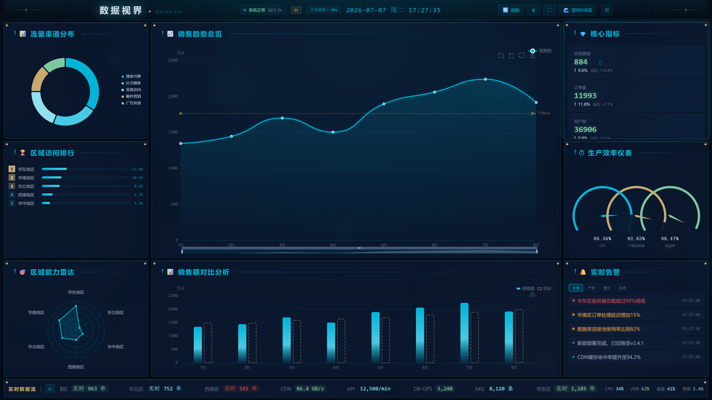
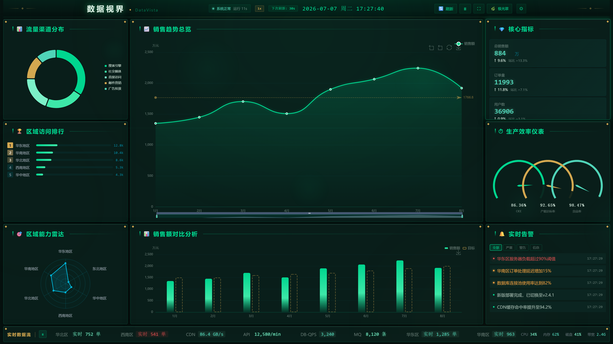
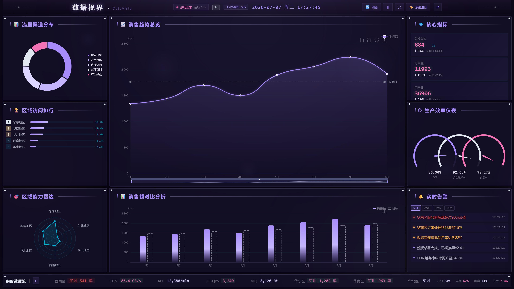
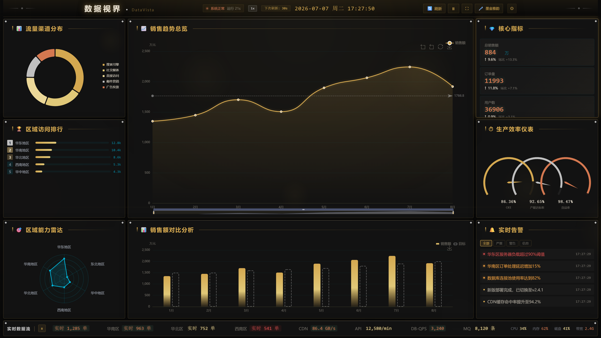
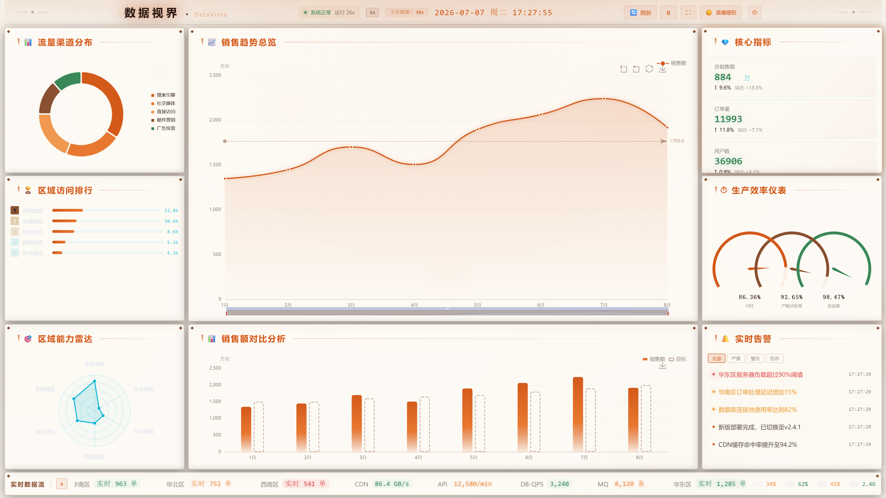
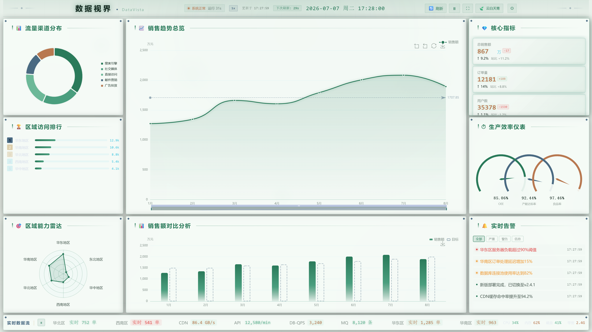
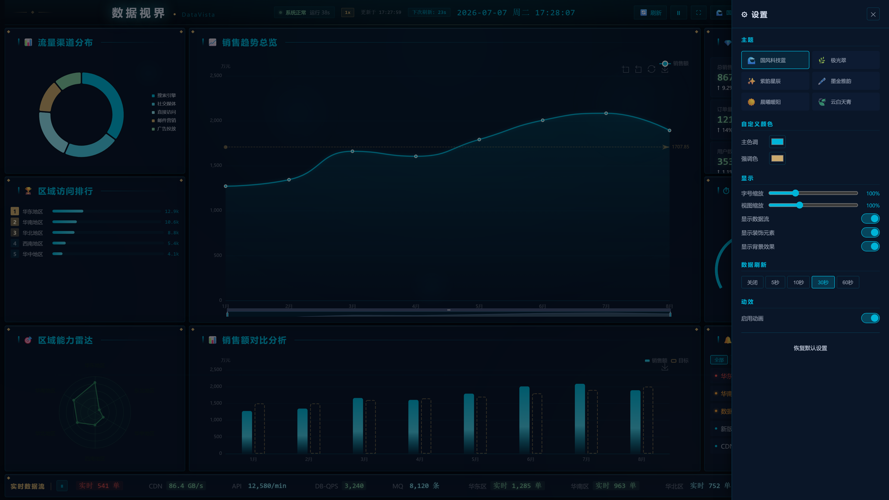
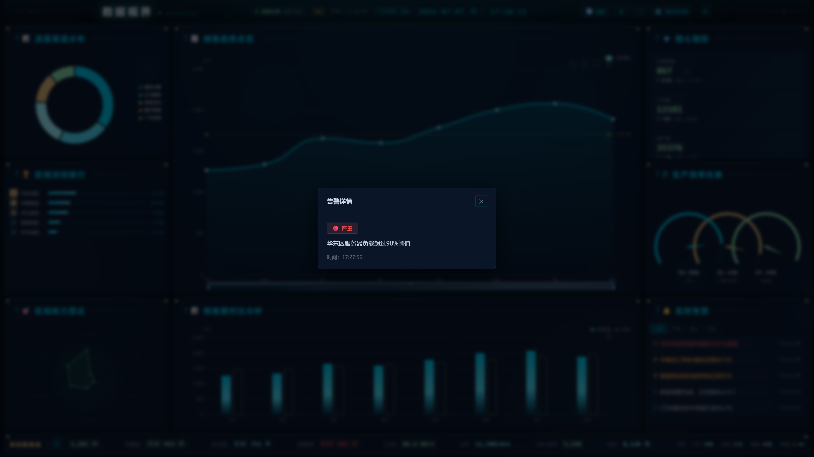
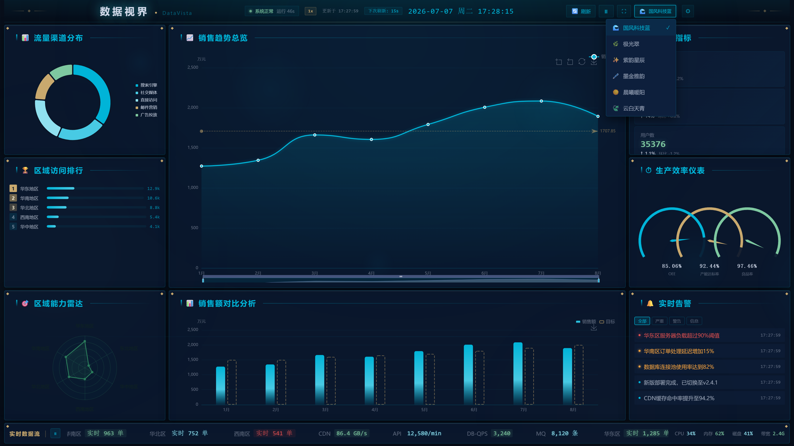

# DataVista / 数据视界

<p align="center">
  
  
  
  
</p>

> 🖥️ 从 0 到 1 构建的专业数据可视化大屏 — 6 套主题 · 实时数据 · 全屏自适应

<p align="center">
  
</p>

---

## ✨ 核心特性

<table>
<tr>
<td width="50%">

### 🎨 六套精美主题
- **国风科技蓝** — 云纹水墨 · 青蓝高亮 · 鎏金点缀
- **极光翠** — 深海墨绿 · 翡翠极光 · 自然呼吸
- **紫韵星辰** — 深空紫蓝 · 星光璀璨 · 银白描边
- **墨金雅韵** — 水墨晕染 · 暖金流光 · 文人雅韵
- **晨曦暖阳** ☀️ — 奶油暖白 · 琥珀晨光 · 柔和温暖
- **云白天青** 🍃 — 天青云白 · 淡雅青绿 · 清透如瓷

</td>
<td width="50%">

### 🚀 核心功能
- 🔄 **实时数据刷新** — 可配置间隔，数据平滑过渡
- 📊 **7 种图表** — 折线/柱状/环形/仪表/雷达/排行/数据流
- 🖱️ **丰富交互** — 图表缩放、图例开关、告警筛选、弹窗详情
- 🎯 **等比缩放** — 任意分辨率严格等比居中，手动缩放倍率
- ⚙ **全功能设置** — 字号/刷新率/动画/配色全部可配
- ⌨ **键盘快捷键** — F 全屏 · R 刷新 · Space 暂停

</td>
</tr>
</table>

---

## 📸 主题画廊

<p align="center">
  
  
  
  
  
  
</p>

---

## 🎮 功能预览

| 设置面板 | 告警详情 | 主题切换 |
|:---:|:---:|:---:|
|  |  |  |

---

## 🛠️ 技术栈

| 类别 | 技术 |
|------|------|
| 框架 | Vue 3.5 + TypeScript 6.0 |
| 构建 | Vite 8 |
| 图表 | ECharts 6 |
| 状态管理 | Pinia 3 |
| 路由 | Vue Router 5 |
| 样式 | SCSS + CSS 自定义属性 |
| 数据 Mock | MSW 2 |
| HTTP | Axios |
| 测试 | Vitest 4 + Playwright |
| 代码规范 | ESLint 10 + Prettier + Stylelint |

---

## 🚀 快速开始

```bash
# 克隆项目
git clone https://github.com/DaPengRuYi/DataVista.git
cd DataVista

# 安装依赖
npm install

# 启动开发服务器 (端口 10001)
npm run dev

# 一键全检 (lint + test + build)
npm run check

# 自动化截图
npm run screenshot
```

---

## ⌨ 键盘快捷键

| 按键 | 功能 |
|:---:|------|
| `F` | 全屏切换 |
| `R` | 刷新数据 |
| `Space` | 播放/暂停自动刷新 |
| `Ctrl+S` | 打开设置面板 |
| `Esc` | 关闭弹窗/面板 |

---

## 📁 项目结构

```
DataVista/
├── public/                  # 静态资源
├── scripts/                 # 工具脚本
│   └── screenshot.mjs       # 自动化截图
├── docs/
│   └── screenshots/         # 截图存档
├── src/
│   ├── adapters/            # 数据源适配层
│   ├── charts/              # 图表组件 (Line/Bar/Pie/Gauge/Radar)
│   ├── components/          # UI 组件
│   │   ├── AlertList/       # 告警列表
│   │   ├── BorderBox/       # 边框面板 (玻璃拟态)
│   │   ├── DataFlow/        # 底部数据流
│   │   ├── DigitalScroll/   # 数字滚动
│   │   ├── Decoration/      # 装饰元素
│   │   ├── Loading/         # 加载状态
│   │   ├── PageHeader/      # 顶部导航
│   │   ├── SettingsPanel/   # 设置面板
│   │   └── StatCard/        # 指标卡片
│   ├── composables/         # 组合式函数
│   │   ├── useAutoResize    # 等比缩放
│   │   ├── useDataRefresh   # 数据刷新引擎
│   │   ├── useFullscreen    # 全屏控制
│   │   ├── useKeyboard      # 键盘快捷键
│   │   └── useTheme         # 主题切换
│   ├── layouts/             # 布局组件
│   ├── mocks/               # MSW Mock 数据
│   ├── services/            # API 服务 + 日志
│   ├── stores/              # Pinia Store
│   ├── styles/              # 全局样式 + SCSS 变量
│   ├── themes/              # 6 套主题配置
│   ├── types/               # TypeScript 类型
│   ├── utils/               # 工具函数 (format/chart-config)
│   └── views/               # 页面视图
├── task_plan.md             # 开发计划
├── findings.md              # 技术调研
└── progress.md              # 开发进度
```

---

## 📊 数据刷新机制

```
 自动定时器 / 手动 R 键
         ↓
  DataRefreshManager (可配间隔)
         ↓
  Store.fetchDashboard()
         ↓
  MSW → 带业务规律的 Mock 数据 (±6% 波动)
         ↓
  组件就地更新 (不卸载/不重载)
         ↓
  ┌────────┬──────────┬──────────┐
  ↓        ↓          ↓          ↓
数字滚动  图表缓动   排行换位   光晕闪烁
(1.5s)   (cubicOut)  (0.5s)    (2.2s)
```

---

## 🗺️ 路线图

- [x] 6 套精美主题 + 自定义配色
- [x] 7 种可视化图表
- [x] 等比缩放全屏适配 + 手动缩放
- [x] 实时数据刷新引擎 + 平滑过渡动效
- [x] 完整设置面板 + 配置持久化
- [x] 键盘快捷键 + 交互弹窗
- [x] 自动化截图系统
- [x] ESLint + Vitest + 一键全检
- [ ] 地图热力 + 关系图谱
- [ ] 后端 API 数据源接入
- [ ] Docker 部署 + GitHub Pages

---

## 📄 开源协议

MIT License © 2024 [DaPengRuYi](https://github.com/DaPengRuYi)

---

<p align="center">
  <b>DataVista</b> — 让数据一览无余 ✨
</p>
